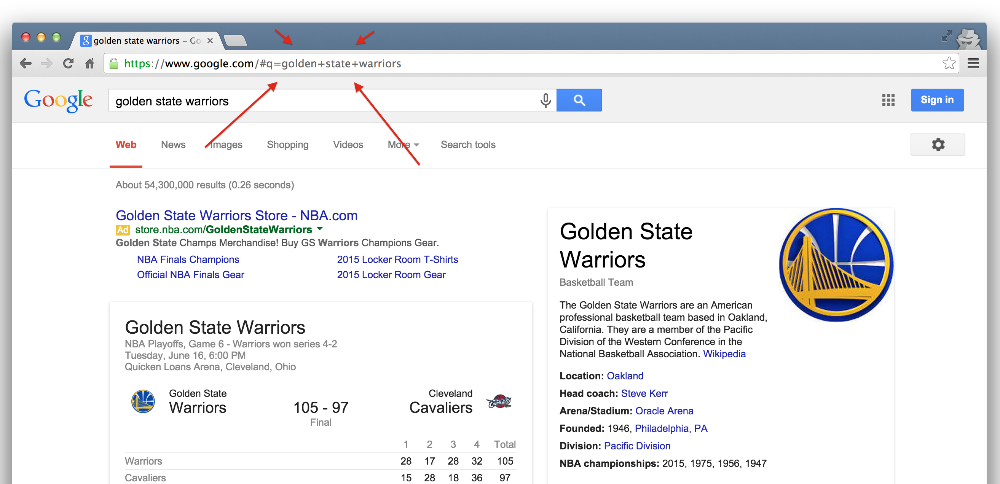
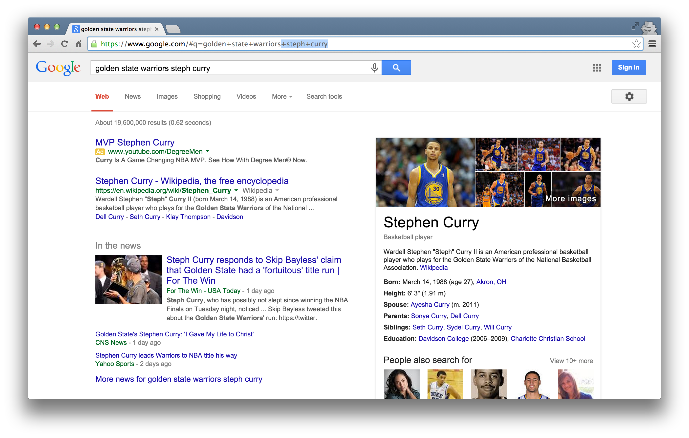

# Accessing Data: Some Preliminary Considerations

Whenever you're trying to get information from the web, it's very important to first know whether you're accessing it through appropriate means.

The UC Berkeley library has some excellent resources on this topic. Here is a flowchart that can help guide your course of action:

You can see the library's licensed sources [here](http://guides.lib.berkeley.edu/text-mining).

# What is an API?

This workshop is about APIs. You may have heard this terminology in a variety of programming settings. What exactly does it mean?

* "API" stands for **Application Programming Interface**.

* Broadly defined, an API is a set of rules and procedures that facilitate interactions between computers and their applications.

* A very common type of API is the Web API, which, among other things, allows users to query a remote database over the internet.

* For example, a web service such as Reddit has many databases that may be of use to us: Posts, Users, Subreddits, etc. If we want to access some portion of these databases, it'd be helpful to have a set of rules and protocols in place to outline how we access this information. This is the motivation for an API.

* Web APIs take on a variety of formats, but the vast majority adhere to a particular style known as **Representational State Transfer** or **REST**.

* What makes these "RESTful" APIs so convenient is that we can use them to query databases using URLs.

## RESTful Web APIs Are All Around You

Consider a simple Google search:

Ever wonder what all that extra stuff in the address bar was all about?  In this case, the full address is Google's way of sending a query to its databases asking requesting information related to the search term "golden state warriors". 

In fact, it looks like Google makes its query by taking the search terms, separating each of them with a "+", and appending them to the link "https://www.google.com/#q=".  Therefore, we should be able to actually change our Google search by adding some terms to the URL and following the general format:

Using RESTful APIs is essentially formatting these URLs so that you can get the response you want.

## Some Terminology

* **Uniform Resource Locator (URL)**: a string of characters that, when interpreted via the Hypertext Transfer Protocol (HTTP), points to a data resource, notably files written in Hypertext Markup Language (HTML) or a subset of a database.  This is often referred to as a "call".

* **HTTP Methods/Verbs**:

    + *GET*: requests a representation of a data resource corresponding to a particular URL.  The process of executing the GET method is often referred to as a "GET request" and is the main method used for querying RESTful databases.
    
    + *HEAD*, *POST*, *PUT*, *DELETE*: other common methods, though mostly never used for database querying.
    
As you might suspect from the example above, surfing the web is basically equivalent to sending a bunch of GET requests to different servers and asking for different files written in HTML.

## API Examples

- [**Reddit**](https://www.reddit.com/dev/api/):
Used for pulling Reddit data, posting status updates, and more. 

- [**Spotify**](https://developer.spotify.com/):
Access to rich song data data such as valence, energy, and danceability metrics.

-  [**Watson IBM Natural Language Inference API**](https://cloud.ibm.com/apidocs/natural-language-understanding):
Use state of the art NLP models to analyze text sentiment, extract named entities, and classify text.

## API or Web Scraping?

When deciding between using an API or web scraping, you should consider both the method's legality and efficiency. APIs provide structured, authorized access to data, often with clear documentation and rate limits to manage server load.

Web scraping, on the other hand, involves extracting data from web pages, which may violate a site's terms of service or lead to challenges in navigating complex page structures.

While scraping can be useful when no API is available, APIs are generally the preferred method for accessing web data due to their reliability and compliance with legal standards.